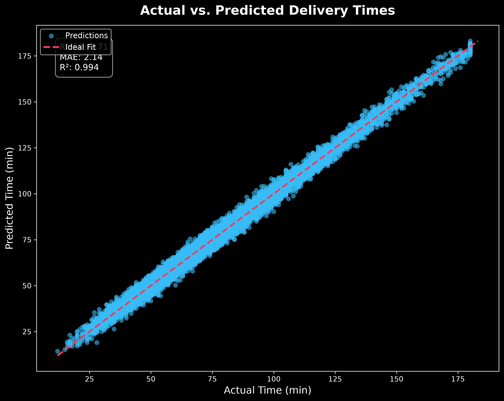
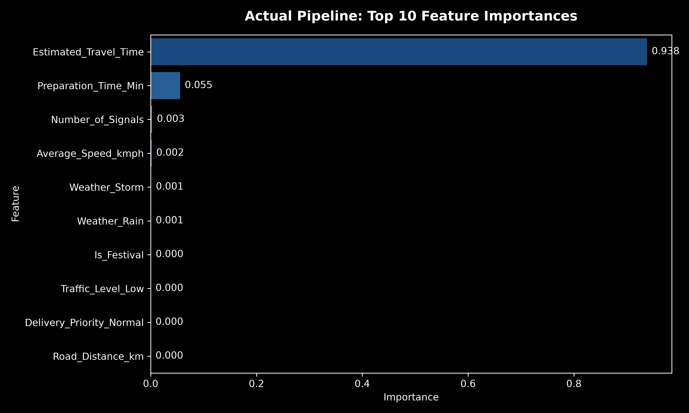
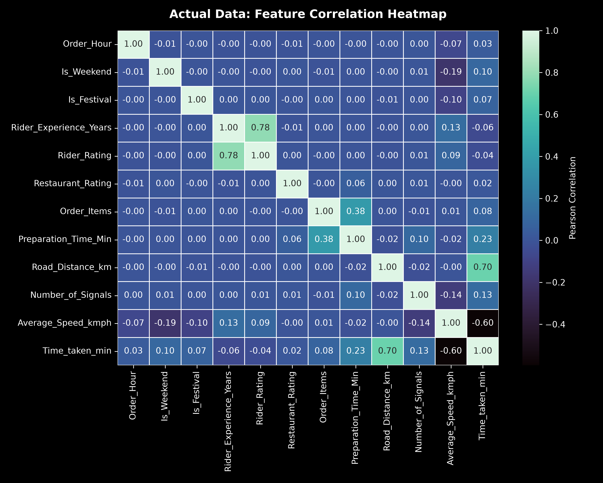
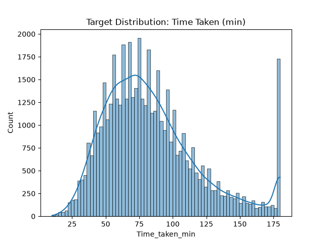

🍔 Food Delivery Time Prediction

End-to-End Machine Learning • Streamlit • Flask API • Docker

  <strong>Predict food delivery time in minutes using a trained Gradient Boosting regression pipeline.</strong>

  
  

  
  
  
  
  
  
  

🖼️ Project Overview

  

📌 Project at a Glance

Area

Implementation

Problem

Food delivery time prediction

Type

Supervised Machine Learning / Regression

Target

Time_taken_min

Main Model

Gradient Boosting Regressor

Preprocessing

Imputation + Scaling + One-Hot Encoding

Model Selection

Baseline comparison + RandomizedSearchCV

Model Persistence

Joblib .pkl pipeline

Web App

Streamlit

API

Flask

Containerization

Docker

Source Control

GitHub

Container Registry

Docker Hub

🎯 Objective

The goal of this project is to estimate food delivery time in minutes using delivery and operational factors such as:

🚗 Road distance

⚡ Average speed

🚦 Traffic level

🌦️ Weather

🛵 Vehicle type

📅 Day of week

🍽️ Preparation time

⭐ Rider and restaurant ratings

📦 Order information

📍 Pickup / drop-off information

Example

Road Distance      : 2.4 km
Average Speed      : 40 km/h
Traffic Level      : Medium
Weather            : Clear
Vehicle Type       : Scooter
Day of Week        : Monday
                     ↓
        Estimated Delivery Time

🔄 End-to-End Workflow

┌─────────────────────┐
│  Food Delivery Data │
└──────────┬──────────┘
           ↓
┌─────────────────────┐
│ 1. Data Inspection  │
│       / EDA         │
└──────────┬──────────┘
           ↓
┌─────────────────────┐
│ 2. Data Cleaning    │
└──────────┬──────────┘
           ↓
┌─────────────────────┐
│ 3. Feature          │
│    Engineering      │
└──────────┬──────────┘
           ↓
┌─────────────────────┐
│ 4. Preprocessing    │
│ Imputer / Scaler /  │
│ OneHotEncoder       │
└──────────┬──────────┘
           ↓
┌─────────────────────┐
│ 5. Train / Test     │
│      80 / 20        │
└──────────┬──────────┘
           ↓
┌─────────────────────┐
│ 6. Baseline Models  │
│ RF + Gradient Boost │
└──────────┬──────────┘
           ↓
┌─────────────────────┐
│ 7. Gradient Boosting│
│       Model         │
└──────────┬──────────┘
           ↓
┌─────────────────────┐
│ 8. Hyperparameter   │
│   Tuning / CV       │
└──────────┬──────────┘
           ↓
┌─────────────────────┐
│ 9. Evaluation       │
│ RMSE / MAE / R²     │
└──────────┬──────────┘
           ↓
┌─────────────────────┐
│ delivery_time_model │
│       .pkl          │
└──────────┬──────────┘
           ↓
      ┌────┴─────┐
      ↓          ↓
┌────────────┐ ┌────────────┐
│  Streamlit │ │   Flask    │
│     UI     │ │ REST API   │
└─────┬──────┘ └─────┬──────┘
      └──────┬───────┘
             ↓
        🐳 Docker

📂 Dataset

The project was developed using:

Food_Delivery_Time_Prediction.csv

Dataset details

Rows: 50,000

Original columns: 24

Target: Time_taken_min

Problem type: Regression

Main features

Feature

Purpose

Road_Distance_km

Road distance for delivery

Average_Speed_kmph

Average travel speed

Traffic_Level

Traffic condition

Weather

Weather condition

Vehicle_Type

Delivery vehicle

Day_of_Week

Order day

Preparation_Time_Min

Restaurant preparation time

Number_of_Signals

Signals on route

Rider_Experience_Years

Rider experience

Rider_Rating

Rider rating

Restaurant_Rating

Restaurant rating

Cuisine_Type

Cuisine category

Order_Items

Number of items

Restaurant_Load

Restaurant workload

Delivery_Priority

Delivery priority

Time_taken_min

Target variable

🧠 Machine Learning Pipeline

1️⃣ Data Inspection & EDA

The dataset is inspected for:

Shape

Missing values

Data types

Target distribution

Generated visualization:

assets/target_distribution.png

2️⃣ Data Cleaning

The supplied ML workflow removes:

df_clean = df.drop(columns=["Order_ID", "Order_Date"])

Order_ID is a unique identifier and Order_Date is not directly used as a model feature in the supplied workflow.

3️⃣ Feature Engineering

A domain-specific feature is created:

Estimated_Travel_Time

Estimated_Travel_Time =
(Road_Distance_km / Average_Speed_kmph) × 60

The implementation protects the division using:

np.maximum(df_clean["Average_Speed_kmph"], 1)

This creates a meaningful representation of expected travel duration.

4️⃣ Preprocessing

Numerical pipeline

SimpleImputer(strategy="median")
                ↓
StandardScaler()

Categorical pipeline

SimpleImputer(strategy="most_frequent")
                ↓
OneHotEncoder(
    handle_unknown="ignore",
    sparse_output=False
)

Why use a Pipeline?

The transformations are kept together with the model so the same preprocessing logic is applied during training and inference.

5️⃣ Train / Test Split

The project uses:

train_test_split(
    X,
    y,
    test_size=0.2,
    random_state=42
)

Split

80% → Training
20% → Testing

🤖 Model Development

Baseline Models

Two baseline regressors were evaluated:

RandomForestRegressor(random_state=42)

GradientBoostingRegressor(random_state=42)

Recorded baseline results

Model

RMSE

MAE

R²

Random Forest

3.040

2.374

0.993

Gradient Boosting

2.883

2.294

0.993

Based on the recorded results, Gradient Boosting performed slightly better than the Random Forest baseline.

🚀 Final Gradient Boosting Model

The supplied main model configuration is:

GradientBoostingRegressor(
    n_estimators=150,
    learning_rate=0.08,
    max_depth=4,
    random_state=42
)

The model is combined with the preprocessing stage inside a single Scikit-Learn Pipeline.

🔍 Hyperparameter Tuning

The project also uses RandomizedSearchCV.

param_dist = {
    "regressor__n_estimators": [100, 200, 300],
    "regressor__learning_rate": [0.01, 0.05, 0.1, 0.2],
    "regressor__max_depth": [3, 5, 7],
    "regressor__min_samples_split": [2, 5, 10],
}

Configuration

n_iter          = 10
cv              = 5
scoring         = neg_root_mean_squared_error
random_state    = 42
n_jobs          = -1

Note: The supplied notebook recorded a KeyboardInterrupt during one tuning run. Therefore, this repository does not claim an unverified final tuning score.

📈 Model Evaluation

The project evaluates regression predictions with:

Metric

Meaning

Better

RMSE

Penalizes larger errors

Lower

MAE

Average absolute error

Lower

R²

Explained variance

Higher

Actual vs Predicted

Actual values
      ↓
     y_test
      ↕
Prediction
      ↓
best_model.predict(X_test)

The visualization can be found at:

assets/actual_vs_predicted.png

  

🔎 Feature Importance

The recorded feature-importance output showed:

Estimated_Travel_Time

as the dominant feature, followed by features including:

Preparation_Time_Min

Number_of_Signals

Average_Speed_kmph

Weather-related encoded features

Is_Festival

Traffic-related features

  

📊 EDA Visualizations

Correlation Heatmap

  

Target Distribution

  

🖥️ Streamlit Application

The project includes an interactive Streamlit application:

streamlit_app.py

User inputs

Road Distance

Average Speed

Traffic Level

Weather

Vehicle Type

Day of Week

Prediction flow

User Input
    ↓
prepare_features()
    ↓
Model-Compatible DataFrame
    ↓
delivery_time_model.pkl
    ↓
model.predict()
    ↓
Estimated Arrival Time

Run locally

python3 -m streamlit run streamlit_app.py

Open:

http://localhost:8501

🌐 Flask API

The same trained model can also be consumed through Flask.

File:

app.py

Routes

GET  /
POST /predict_ui
POST /predict

Example JSON request

{
  "Road_Distance_km": 2.4,
  "Average_Speed_kmph": 40,
  "Traffic_Level": "Medium",
  "Weather": "Clear",
  "Vehicle_Type": "Scooter",
  "Day_of_Week": "Monday"
}

Run Flask

python3 app.py

Open:

http://localhost:5000

📦 Model Artifact

The trained model is persisted as:

delivery_time_model.pkl

Training

CSV
 ↓
Feature Engineering
 ↓
Preprocessing
 ↓
Gradient Boosting
 ↓
Joblib
 ↓
delivery_time_model.pkl

Inference

User Input
 ↓
prepare_features()
 ↓
delivery_time_model.pkl
 ↓
Prediction

🧰 Technology Stack

Technology

Purpose

🐍 Python

Core programming language

🐼 Pandas

Data handling

🔢 NumPy

Numerical operations

🤖 Scikit-Learn

ML pipeline and models

📦 Joblib

Model persistence

📊 Matplotlib

Visualization

📈 Seaborn

Statistical visualization

🌐 Flask

REST API

🎈 Streamlit

Interactive web application

🐳 Docker

Containerization

🐙 GitHub

Source control / portfolio

📦 Docker Hub

Image registry

📁 Repository Structure

Food-Delivery-Time-Prediction-ML_Model/
│
├── streamlit_app.py
├── app.py
├── ml_delivery_time_prediction_final.ipynb
├── delivery_time_model.pkl
│
├── requirements.txt
├── Dockerfile
├── .dockerignore
├── .gitignore
├── README.md
├── LICENSE
│
└── assets/
    ├── project_overview.png
    ├── correlation_heatmap.png
    ├── feature_importance.png
    ├── actual_vs_predicted.png
    └── target_distribution.png

Keep out of GitHub

ml_env/
venv/
.venv/
__pycache__/
.ipynb_checkpoints/

📥 Installation

1. Clone

git clone https://github.com/shaikafzalhussain/Food-Delivery-Time-Prediction-ML_Model.git
cd Food-Delivery-Time-Prediction-ML_Model

2. Create virtual environment

macOS / Linux

python3 -m venv venv
source venv/bin/activate

Windows

python -m venv venv
venv\Scripts\activate

3. Install dependencies

python3 -m pip install -r requirements.txt

📦 Requirements

flask>=3.0.0
streamlit>=1.30.0
scikit-learn>=1.4.0
pandas>=2.0.0
numpy>=1.26.0
joblib>=1.3.0
watchdog>=4.0.0

For production reproducibility, pin the exact versions used to train and serialize delivery_time_model.pkl.

🐳 Docker Deployment

Build image

docker build -t food-delivery-time-prediction .

Run container

docker run --rm -p 8501:8501 food-delivery-time-prediction

Open:

http://localhost:8501

☁️ Streamlit Community Cloud

Deploy the repository from GitHub with:

Repository:
shaikafzalhussain/Food-Delivery-Time-Prediction-ML_Model

Branch:
main

Main file:
streamlit_app.py

Then replace the placeholder at the top of this README:

YOUR_STREAMLIT_APP_URL

with your actual deployed .streamlit.app URL.

🐳 Docker Hub

docker login

docker tag food-delivery-time-prediction \
YOUR_DOCKERHUB_USERNAME/food-delivery-time-prediction:latest

docker push \
YOUR_DOCKERHUB_USERNAME/food-delivery-time-prediction:latest

Then anyone can run:

docker pull \
YOUR_DOCKERHUB_USERNAME/food-delivery-time-prediction:latest

docker run --rm -p 8501:8501 \
YOUR_DOCKERHUB_USERNAME/food-delivery-time-prediction:latest

⭐ Key Project Highlights

✅ Capability

✅ Implementation

Regression ML

Gradient Boosting

Feature Engineering

Estimated Travel Time

Preprocessing

Imputation + Scaling + Encoding

Model Selection

Baseline comparison

Hyperparameter Search

RandomizedSearchCV

Evaluation

RMSE + MAE + R²

Model Persistence

Joblib

Web UI

Streamlit

API

Flask

Deployment

Docker

Portfolio

GitHub

🔮 Future Improvements

🚦 Real-time traffic API integration

🌦️ Live weather API integration

🤖 Advanced boosting models

📊 Model monitoring and drift detection

🔄 Automated retraining

☁️ AWS / Azure / GCP deployment

🔐 API authentication

📈 Prediction monitoring and logging

🎨 Enhanced production UI

⚙️ Automated CI/CD

👤 Author

Shaik Afzal Hussain

📄 License

This project can be distributed under the MIT License.

Add an LICENSE file containing the MIT license text if you intend to publish the repository under MIT terms.

🚀 From Raw Data → Machine Learning → Web App → API → Docker

Built as an end-to-end Machine Learning deployment project.

